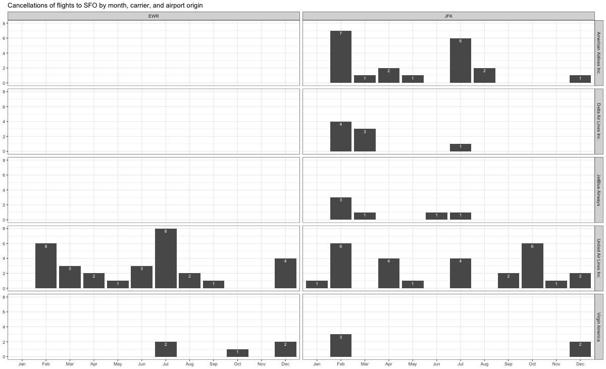

```{r}
#| label: load-libraries
#| echo: false # This option disables the printing of code (only output is displayed).
#| message: false
#| warning: false

library(tidyverse)
library(nycflights13)
library(skimr)

```

# Data Manipulation `nycflights13`

## Problem 1: What months had the highest and lowest proportion of cancelled flights? Interpret any seasonal patterns. 


To determine if a flight was cancelled use the following code

```{r}

# What months had the highest and lowest % of cancelled flights?

flights %>% 
  filter(is.na(dep_time)) 

```

## Problem 2: What plane (specified by the `tailnum` variable) traveled the most times from New York City airports in 2013? 

Please `left_join()` the resulting table with the table `planes` (also included in the `nycflights13` package).

For the plane with the greatest number of flights and that had more than 50 seats, please create a table where it flew to during 2013.

```{r}


```

## Problem 3: Use the `flights` and `planes` tables to answer the following questions:

```         
-   How many planes have a missing date of manufacture?
-   What are the five most common manufacturers?
-   Has the distribution of manufacturer changed over time as reflected by the airplanes flying from NYC in 2013? (Hint: you may need to use case_when() to recode the manufacturer name and collapse rare vendors into a category called Other.)
```

```{r}

```

## Problem 4: Which carriers service the route to San Francisco International (SFO). 


Join the `flights` and `airlines` tables and count which airlines flew the most to SFO. Produce a new dataframe, `fly_into_sfo` that contains three variables: the `name` of the airline, e.g., `United Air Lines Inc.` not `UA`, the count (number) of times it flew to SFO, and the `percent` of the trips that that particular airline flew to SFO.

```{r}

```

And here is some bonus ggplot code to plot your dataframe

```{r}
#| label: ggplot-flights-toSFO
#| message: false
#| warning: false
#| eval: false


fly_into_sfo %>% 
  
  # sort 'name' of airline by the numbers it times to flew to SFO
  mutate(name = fct_reorder(name, count)) %>% 
  
  ggplot() + 
  
  aes(x = count, 
      y = name) +
  
  # a simple bar/column plot
  geom_col() +
  
  # add labels, so each bar shows the % of total flights 
  geom_text(aes(label = percent),
             hjust = 1, 
             colour = "white", 
             size = 5)+
  
  # add labels to help our audience  
  labs(title="Which airline dominates the NYC to SFO route?", 
       subtitle = "as % of total flights in 2013",
       x= "Number of flights",
       y= NULL) +
  
  theme_minimal() + 
  
  # change the theme-- i just googled those , but you can use the ggThemeAssist add-in
  # https://cran.r-project.org/web/packages/ggThemeAssist/index.html
  
  theme(#
    # so title is left-aligned
    plot.title.position = "plot",
    
    # text in axes appears larger        
    axis.text = element_text(size=12),
    
    # title text is bigger
    plot.title = element_text(size=18)
      ) +

  # add one final layer of NULL, so if you comment out any lines
  # you never end up with a hanging `+` that awaits another ggplot layer
  NULL
 
 
```

## Problem 5: Cancellations of flights to SFO. 


We create a new dataframe `cancellations` as follows

```{r}

cancellations <- flights %>% 
  
  # just filter for destination == 'SFO'
  filter(dest == 'SFO') %>% 
  
  # a cancelled flight is one with no `dep_time` 
  filter(is.na(dep_time))

```

I want you to think how we would organise our data manipulation to create the following plot. No need to write the code, just explain in words how you would go about it.



# Rents in San Francsisco 2000-2018

[Kate Pennington](https://www.katepennington.org/data) created a panel of historic Craigslist rents by scraping posts archived by the Wayback Machine. You can read more about her work here

[What impact does new housing have on rents, displacement, and gentrification in the surrounding neighborhood? Read our interview with economist Kate Pennington about her article, "Does Building New Housing Cause Displacement?:The Supply and Demand Effects of Construction in San Francisco."](https://matrix.berkeley.edu/research-article/kate-pennington-on-gentrification-and-displacement-in-san-francisco/)

In our case, we have a clean(ish) dataset with about 200K rows that correspond to Craigslist listings for renting properties in the greater SF area. The data dictionary is as follows

| variable    | class     | description           |
|-------------|-----------|-----------------------|
| post_id     | character | Unique ID             |
| date        | double    | date                  |
| year        | double    | year                  |
| nhood       | character | neighborhood          |
| city        | character | city                  |
| county      | character | county                |
| price       | double    | price in USD          |
| beds        | double    | n of beds             |
| baths       | double    | n of baths            |
| sqft        | double    | square feet of rental |
| room_in_apt | double    | room in apartment     |
| address     | character | address               |
| lat         | double    | latitude              |
| lon         | double    | longitude             |
| title       | character | title of listing      |
| descr       | character | description           |
| details     | character | additional details    |

The dataset was used in a recent [tidyTuesday](https://github.com/rfordatascience/tidytuesday) project.

```{r}
# download directly off tidytuesdaygithub repo

rent <- readr::read_csv('https://raw.githubusercontent.com/rfordatascience/tidytuesday/master/data/2022/2022-07-05/rent.csv')

```

What are the variable types? Do they all correspond to what they really are? Which variables have most missing values?

```{r skim_data}
# YOUR CODE GOES HERE
skimr::skim(rent)

```

Make a plot that shows the top 20 cities in terms of % of classifieds between 2000-2018. You need to calculate the number of listings by city, and then convert that number to a %.

The final graph should look like this

```{r, echo=FALSE, out.width="90%"}
knitr::include_graphics(here::here("images", "top_cities.png"), error = FALSE)
```


```{r top_cities}
# YOUR CODE GOES HERE


```

Make a plot that shows the evolution of median prices in San Francisco for 0, 1, 2, and 3 bedrooms listings. The final graph should look like this


```{r, echo=FALSE, out.width="90%"}
knitr::include_graphics(here::here("images", "sf_rentals.png"), error = FALSE)
```


```{r sf_median_prices}

# YOUR CODE GOES HERE


```

Finally, make a plot that shows median rental prices for one-bed flats in the top 12 cities in the Bay area. Your final graph should look like this


```{r, echo=FALSE, out.width="90%"}
knitr::include_graphics(here::here("images", "one_bed_bay_area.png"), error = FALSE)
```


```{r spirit_plot}
# YOUR CODE GOES HERE

```

What can you infer from these plots? Don't just explain what's in the graph, but speculate or tell a short story (1-2 paragraphs max).

## Challenge

How would you go about creating this?


```{r, echo=FALSE, out.width="90%"}
knitr::include_graphics(here::here("images", "challenge1.png"), error = FALSE)
```


> TYPE YOUR ANSWER AFTER (AND OUTSIDE!) THIS BLOCKQUOTE.

# On your own -- Hollywood Age Gap

The website <https://hollywoodagegap.com> is a record of *THE AGE DIFFERENCE IN YEARS BETWEEN MOVIE LOVE INTERESTS*. This is an informational site showing the age gap between movie love interests and the data follows certain rules:

-   The two (or more) actors play actual love interests (not just friends, coworkers, or some other non-romantic type of relationship)
-   The youngest of the two actors is at least 17 years old
-   No animated characters

The age gaps dataset includes "gender" columns, which always contain the values "man" or "woman". These values appear to indicate how the characters in each film identify and some of these values do not match how the actor identifies. We apologize if any characters are misgendered in the data!

The following is a data dictionary of the variables used

| variable           | class     | description                                                                                             |
|:----------------|:----------------|:-------------------------------------|
| movie_name         | character | Name of the film                                                                                        |
| release_year       | integer   | Release year                                                                                            |
| director           | character | Director of the film                                                                                    |
| age_difference     | integer   | Age difference between the characters in whole years                                                    |
| couple_number      | integer   | An identifier for the couple in case multiple couples are listed for this film                          |
| actor_1_name       | character | The name of the older actor in this couple                                                              |
| actor_2_name       | character | The name of the younger actor in this couple                                                            |
| character_1_gender | character | The gender of the older character, as identified by the person who submitted the data for this couple   |
| character_2_gender | character | The gender of the younger character, as identified by the person who submitted the data for this couple |
| actor_1_birthdate  | date      | The birthdate of the older member of the couple                                                         |
| actor_2_birthdate  | date      | The birthdate of the younger member of the couple                                                       |
| actor_1_age        | integer   | The age of the older actor when the film was released                                                   |
| actor_2_age        | integer   | The age of the younger actor when the film was released                                                 |

```{r}

age_gaps <- readr::read_csv('https://raw.githubusercontent.com/rfordatascience/tidytuesday/master/data/2023/2023-02-14/age_gaps.csv')


```

How would you explore this data set? Here are some ideas of tables/ graphs to help you with your analysis

-   How is `age_difference` distributed? What's the 'typical' `age_difference` in movies?

-   The `half plus seven\` rule. Large age disparities in relationships carry certain stigmas. One popular rule of thumb is the [half-your-age-plus-seven](https://en.wikipedia.org/wiki/Age_disparity_in_sexual_relationships#The_.22half-your-age-plus-seven.22_rule) rule. This rule states you should never date anyone under half your age plus seven, establishing a minimum boundary on whom one can date. In order for a dating relationship to be acceptable under this rule, your partner's age must be:

$$\frac{\text{Your age}}{2} + 7 < \text{Partner Age} < (\text{Your age} - 7) * 2$$ How frequently does this rule apply in this dataset?

-   Which movie has the greatest number of love interests?
-   Which actors/ actresses have the greatest number of love interests in this dataset?
-   Is the mean/median age difference staying constant over the years (1935 - 2022)?
-   How frequently does Hollywood depict same-gender love interests?

# Deliverables

There is a lot of explanatory text, comments, etc. You do not need these, so delete them and produce a stand-alone document that you could share with someone. Render the edited and completed Quarto Markdown (qmd) file as a Word document (use the "Render" button at the top of the script editor window) and upload it to Canvas. You must be commiting and pushing tour changes to your own Github repo as you go along.

# Details

-   Who did you collaborate with: TYPE NAMES HERE
-   Approximately how much time did you spend on this problem set: ANSWER HERE
-   What, if anything, gave you the most trouble: ANSWER HERE

**Please seek out help when you need it,** and remember the [15-minute rule](https://mam2022.netlify.app/syllabus/#the-15-minute-rule){target="_blank"}. You know enough R (and have enough examples of code from class and your readings) to be able to do this. If you get stuck, ask for help from others, post a question on Slack-- and remember that I am here to help too!

> As a true test to yourself, do you understand the code you submitted and are you able to explain it to someone else?

# Rubric

13/13: Problem set is 100% completed. Every question was attempted and answered, and most answers are correct. Code is well-documented (both self-documented and with additional comments as necessary). Used tidyverse, instead of base R. Graphs and tables are properly labelled. Analysis is clear and easy to follow, either because graphs are labeled clearly or you've written additional text to describe how you interpret the output. Multiple Github commits. Work is exceptional. I will not assign these often.

8/13: Problem set is 60--80% complete and most answers are correct. This is the expected level of performance. Solid effort. Hits all the elements. No clear mistakes. Easy to follow (both the code and the output). A few Github commits.

5/13: Problem set is less than 60% complete and/or most answers are incorrect. This indicates that you need to improve next time. I will hopefully not assign these often. Displays minimal effort. Doesn't complete all components. Code is poorly written and not documented. Uses the same type of plot for each graph, or doesn't use plots appropriate for the variables being analyzed. No Github commits.
